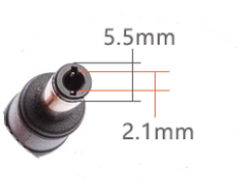

# Heltec Hotspot FAQ Page

## About FAQ

If you have any questions about Heltec Indoor/Outdoor/Light Hotspot, you can get the official reply from Heltec in the following 4 ways:

1. **Recommended** -- Submit a PR to [this project](https://github.com/HelTecAutomation/Heltec-Hotspot-Docs). When we approve your PR, we will also answer your questions and will be shown on this page.  
2. Send your question to Heltec support email: [support@Heltec.cn](mailto:support@Heltec.cn)
3. Reply [this topic](http://community.heltec.cn/t/heltec-indoor-outdoor-light-hotspot-faq-submit/5799) in Heltec Community
4. Talk in [Heltec Discord Channel](https://discord.gg/Pt85TrZfxZ)

### FAQ submit formart example

```
#### Question: [Your question 1 here]? [If you have more than one question, here are your other questions]?
Answer:
```

**===========================================================**

&nbsp;

## Transportation and Business Related FAQ

#### Question: When will my order be shipped?

Answer: All Heltec orders will be shipped within 30 working days. Unfortunately, the precise delivery time depends on the production department and the warehouse’s ordering situation, so we can’t estimate it, but we can be sure that we will ship the goods as quickly as possible within 30 working days in the order of payment.

&nbsp;

#### Question: What is the delivery method? DHL or Fedex?

**Answer: In most cases will use FedEx, partly DHL.**

**Why?**

Our company is located in Chengdu, an inland city of China. The local DHL in our city does not accept packages worth more than 5000 yuan (~770 USD). If for some reason, you require your package must be sent via DHL, your parcel will need to have the following three steps:

1. We send the goods to Shenzhen;
2. The express company in Shenzhen sends the goods to Hong Kong;
3. Wait in line for the warehouse and send the goods to all over the world by Hong Kong DHL.

&nbsp;

#### Question: I have some questions regarding the invoice

Answer:

- **If place an order on the [Heltec website](https://heltec.org/).**

You will be able to download an invoice on the “[My Account](https://heltec.org/my-account/)” page (Orders label). However, this invoice is automatically generated by the system. If the invoice cannot meet your requirements, please contact this email: [support@heltec.cn](mailto:support@heltec.cn)

- **If place an order via [Heltec’s offline sales channel](https://heltec.org/offline-sales/)**

After you get in touch with Heltec and confirm the business details (before payment), our sales staff will send you an email with an invoice attachment. You can communicate your request for an invoice with our sales staff.

&nbsp;

#### ~~Question: If I place an order on the website and choose the payment method of bank transfer, how many days do I have to pay?~~

~~Answer: In the panic buying event on October 1, we added the option of bank transfer. After placing the order, the status of your order will become ‘On hold’. After your transfer is successful to this [bank account](https://resource.heltec.cn/download/Heltec_Automation_Bank_Account_Statement.pdf), please send the transfer information to [finance@heltec.cn](finance@heltec.cn) after the transfer is successful. The email format is as follows:~~

----------------------------------------------------------------

~~**E-mail title:** Proof of Payment~~

~~**Order number:** *#6xxx*~~

~~***And please attach the transfer bill of your bank.***~~

--------------------------------

~~It usually takes 1 to 3 work days to reach our bank account. After reaching the account, we will manually verify and set your bill to processing status.~~ 

~~**Starting from the time of placing the order, if our bank account not receive your payment within 7 working days, we will cancel the order.**~~

&nbsp;

#### Question: I placed an order on the Heltec website, but I did not receive the order confirmation email.

Answer: We are very sorry about this. During the limited time offer, too many orders caused the system to be congested, which may cause some emails to fail to be sent. We are fixing this problem. If not received the confirmation email, that's does not affect our arrangement of your order.

If you need this email as a voucher, you can send the following content to [jiang.qiuyue@heltec.cn](mailto:jiang.qiuyue@heltec.cn)

```
Please resend the confirmation email for order #64xxx
```

&nbsp;

#### ~~Question: If my order is paid by HNT, what is my payment process?~~

~~Answer: Starting from October 6th, for offline orders with a quantity of less than 100 sets, we can accept HNT as the payment method. Please pay according to the amount in the invoice sent to you by our sales staff.~~

~~**Receiving wallet address:** `14MyhtRdt16umDTUQzVDj26oWVPYUaJpHHcLbkKKNLH7Emi2hLd`~~

&nbsp;

#### Question: Why Heltec canceled HNT as a payment method?

Answer: Because the price of HNT fluctuates so much that we often encounter situations like this: For example, yesterday the price of HNT was 22 USD, but today suddenly reached 30 USD, then the customer who paid $22 yesterday asked for a refund. After the refund was completed, then placed an order again and traded at a price of $30.

This situation will greatly increase our workload, **so we changed to accept the more stable USDT as the payment method. USDT payment address please refer to the sales staff who contact you.**

&nbsp;

## Heltec Hotspot Relevant FAQ

#### Question: Will Heltec Indoor Hotspot have Australian version support?

Answer: Yes. There will be a version supporting AU915 in the 902~923 MHz frequency band. We have obtained New Zealand and Australia certification.

&nbsp;

#### Question: Does Heltec have agents or distributors now?

Answer: Before becoming a third-party manufacturer certified by Helium, we have many well-cooperative agents around the world, but these agents only represent the regular products produced by Heltec Automation. **Do not include Heltec Indoor/Outdoor/Light Hotspot.** As of August 26, 2021, we have not identified any distributors.

Future Hotspot agents approved by Heltec will be announced on [https://heltec.org](https://heltec.org).

&nbsp;

#### Question: What type of power plug does the indoor have? Barrel Jack 5.5x2.1mm or 5.5x2.5mm?

Answer: 5.5 x 2.5 x 10mm



#### Question: What's the weight of box with 1 miner antenna and power adapter and default antenna?

Answer: ~ 850g

&nbsp;

#### Question: What's packing list of 1 miner parcel?

Answer:

- Heltec Indoor Hotspot x 1
- 12V / 3A DC adapter x 1;
- DC adapter 220V power cable x 1;
- SMA LoRa antenna with 1.5m cable x 1;

&nbsp;

#### Question: What's the SMA socket type of Heltec Indoor Hotspot?

Answer: We call it inner needle and outer thread. The FCC clearly stipulates that the SMA connector of this interface must be used on the device side.


&nbsp;

#### Question: What's the SMA socket type of the default antenna?

Answer: We call it inner hole inner thread. Can be used directly with Heltec Indoor Hotspot.

&nbsp;

#### Question: Does the Heltec Indoor Hotspot has PoE features?

Answer: The device itself does not have the PoE function, but it can be realized through a [PoE splitter]().


#### Question: What is the material of the Heltec Indoor Hotspot shell?

Answer: The body is made of 6063 aluminum alloy, which has good mechanical strength and thermal conductivity. And the top panel is tempered glass.

&nbsp;

#### Question: Does Heltec Indoor Hotspot support remote modification of the working frequency band?

From the feedback of our customers, we often encounter such situations:

1. I purchased the Heltec Indoor Hotspot with the AU915 frequency band, but Australia is about to use the AS923 frequency band for Helium network.
2. I am on a business trip or studying in the United States, and now I am going back home (such as Thailand, Singapore and some other Southeast Asian countries). Heltec Indoor Hotspot is my property. I hope I can take it home with me.

What should I do when a similar scenario above happens to you? You may want ask can I switch the working frequency band through the remote page?

The hardware configuration in the frequency range of 902～928MHz is the same, and the hardware configuration in the frequency range of 863～870MHz is the same. The working frequency band is realized through software configuration. **So the answer is YES**. We have implemented this feature, but it is not yet open. Before we open this function, please contact us and we will assist you to complete the remote modification.

&nbsp;

#### Question: There is a small hole marked with R on the back of the machine. What is the purpose? Is it the reset button?


Answer: No, it's not reset button. The reset button is the power button on the front of the Heltec Indoor Hotspot. Press once to reset, long press than 4 seconds to shut down.

The button marked with "R" is used to manually flash the system firmware. The usage method will be introduced in the follow-up document.


#### Question: Why is my machine status is Relayed?

Answer: The main reason is because the network that your miner connected does not have a public IP address. In the relayed state, miner connecting to the blockchain network via another device through the P2P network. Due to network delays and other reasons, the success rate of challenges and witnesses will decrease.

&nbsp;

#### Question: How can I make my miner not on the Relayed status?

Answer:

Two points:

1. You need have an public IP address, this can be applied to the local operator department to change your network's IP address into a public IP, or it can be achieved through a VPN solution;
2. On the the router, mapping the 44158 port to miner.

``` Note:: The VPN configuration method is not within the scope of our technical support.
```

&nbsp;

#### Question: How many HNT can be dig every day?

Answer: As of November 11, 2021, there are a total of ~305,000 hotspots on the Helium . Excluding some offline and invalid devices, there are a total of about 280,000 valid hotspots.


At present, the total number of HNT that can be mined every day is ~50,000, so on average, each machine can currently dig 0.18 coins per day.


But this does not mean that if your miner is plugged in and connected to the network, it can generate 0.18 HNT. This is related to the network status, the number of surrounding devices, the number of challenges, and the number of witnesses. For more detail rule please refer to [Helium offical documents](https://docs.helium.com/blockchain).

&nbsp;

#### Answer: There are many hotspots near by, why my hotspot has very little witness rewards?

Answer: First of all, is your miner in the relayed state?

If it is in the relayed state, your miner connected to the main network via other devices through P2P forwarding. This is a probability problem, it is possible that the network of the device you are connected to is very poor, causing the signal from your device to fail to relay.

**Now let us analyze a specific situation we encountered:**

The miner received other devices' PoC signal, and send back the witness LoRa signal normal.


But many witness didn't send out via the network success.


Why does this happen? We checked its network connection. The equipment is in Europe, but its P2P network is connected to far away in the United States. The network delay caused the unsuccessful sending of witness.


**The above situation can also explain why the miner near me has a lot of successful witness rewards, but my miner has very few witness rewards. Just because the device with more rewards may be connected to the device closer to you through the P2P network, the network delay is smaller.**

