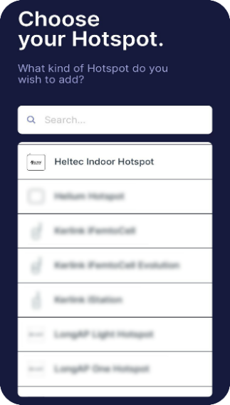
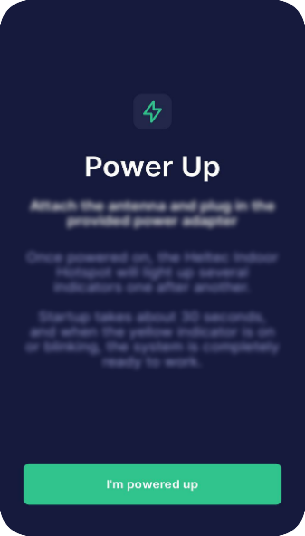
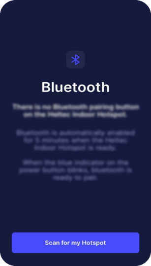
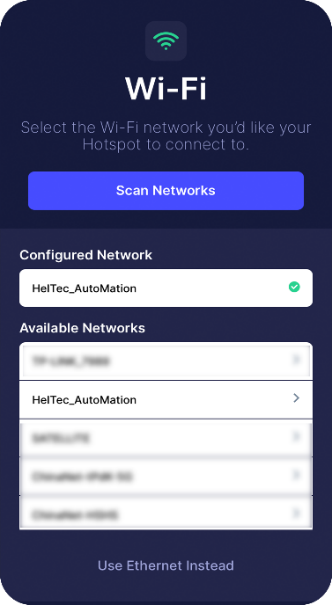
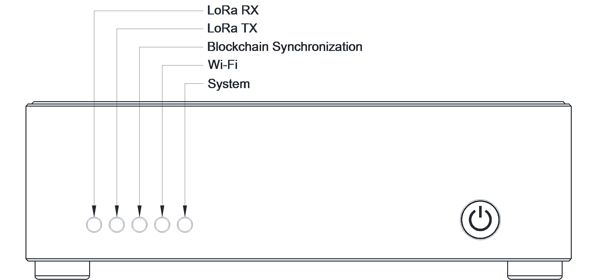

*********************************
Heltec Indoor Hotspot User Manual
*********************************

.. warning::

    After the machine is connected to the network (either by inserting the network cable before the Helium APP connection, or after configuring the Wi-Fi through the Helium APP), it will start to update the firmware of the miner and start to synchronize the blockchain. If the power is cut off at this time, a system error may occur.

.. warning::

    Please press and hold the shutdown button to shut down. Direct power failure may damage the eMMC.

Activation process
==================

Step 1: Download Helium APP through Apple Store / Google Play.

Step 2: Connect the antenna first (required), and insert the network cable (if needed). Plug in the power cord and Hotspot will automatically turn on.

Step 3: Use Helium APP to connect to Hotspot.

* Select Heltec Indoor Hotspot in the Hotspot list.

* Read Hotspot deployment and diagnostic instructions.

* Orange light is always on or flashing, system start up.

* When the power button LED flashes, Bluetooth is turned on.

* Choose your Hotspot and connect via Bluetooth.

* According to your situation, choose to use Ethernet or Wi-Fi.

Description
===========

LED Description
---------------

+----------------------------+--------+---------------------------------------------------------------------------------------+
| Function                   | Color  | Description                                                                           |
+============================+========+=======================================================================================+
| LoRa TX                    | Green  | The LED flashes when LoRa sends data.                                                 |
+----------------------------+--------+---------------------------------------------------------------------------------------+
| Blockchain Synchronization | Orange | *Blinking: Bockchain synchronizing.      *Steady on: Blockchain synchronize complete. |
+----------------------------+--------+---------------------------------------------------------------------------------------+
| Wi-Fi                      | Blue   | Wi-Fi connection is successful.                                                       |
+----------------------------+--------+---------------------------------------------------------------------------------------+
| System                     | White  | HT-M2808 Linux kernel running.                                                        |
+----------------------------+--------+---------------------------------------------------------------------------------------+

Power Button Description
------------------------

* Short press: Restart the system.
* Press longer than 3 seconds [1]_: System shut down.
* The blue light of the power button flashes five minutes after the device is powered on or reset, and Hotspot's Bluetooth can be found and paired at this time.

.. [1] Long press the button for 3 seconds, and then release the button when the LED lights are all off.

Bluetooth Description
---------------------

The blue light on the power button will continue to flash for 5 minutes after the system is turned on, and the Hotspot Bluetooth will be activated. If the Bluetooth is not connected within 5 minutes, it will be turned off automatically.

Packing List
============

+---------------------------------------+------+---------+
| Name                                  | Unit | Quality |
+=======================================+======+=========+
| Heltec Indoor Hotspot                 | PCS  | 1       |
+---------------------------------------+------+---------+
| 12V / 3A DC Adapter                   | PCS  | 1       |
+---------------------------------------+------+---------+
| DC adapter 110/220V power wire        | PCS  | 1       |
+---------------------------------------+------+---------+
| SMA LoRa antenna (1.5m shielded wire) | PCS  | 1       |
+---------------------------------------+------+---------+

For more information about Heltec Indoor Hotspot, please visit: `https://heltec.org/project/ht-m2808 <https://heltec.org/project/ht-m2808>`_ .

